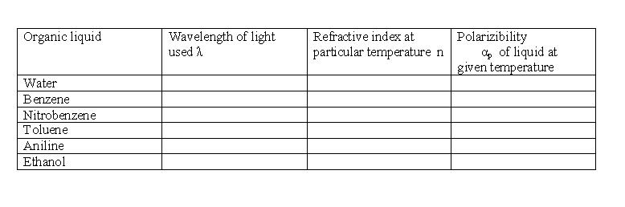

## Procedure

### Apparatus 
 

Abbe's refractometer, temperature controller, light source and samples.

<h2>Procedure for Simulation</h2>

<ul>
  <li>To switch the views of the equipment, click the left and right arrows on the bottom of the simulator.</li>
  <li>Turn on the light source.</li>
  <li>Choose the liquid sample.</li>
  <li>Water is used first to calibrate the instrument.</li>
  <li>Turn the refractometer scale knob to get the clear interface between the illuminated and dark regions.</li>
  <li>Read the index of refraction using the telescope scale.</li>
  <li>Temperature of the sample can be varied by using the slider.</li>
  <li>Repeat the experiment with different liquids and study the variation of refractive index with temperature and wavelength.</li>
</ul>

<h2>Procedure for Doing Real Lab</h2>

Abbe's refractometer is used to measure the refractive index of the given organic liquid. Using a particular monochromatic light source, the apparatus is calibrated with water as the liquid. Adjust the micrometer screw to focus the boundary between the bright and dark regions. Adjust the refractometer scale to place the cross wire of the telescope exactly on the boundary between the bright and dark regions. Repeat the same process for different organic liquids after the equipment is calibrated.

<h2>Observations and Calculations</h2>

<strong>Refractive index of the material “n” at given temperature = ............</strong>

<strong>Polarizability:</strong>

$$\alpha_p = \frac{3\varepsilon_0 M (n^2 - 1)}{N_A \rho (n^2 + 2)}$$

<ul>
  <li>&epsilon;0 - permittivity in free space = 1.</li>
  <li>n - refractive index of the given liquid at a particular temperature.</li>
  <li>NA - Avogadro number = 6.023 &times; 1023 mol–1.</li>
  <li>M and &rho; are the molecular mass and density of the given liquid.</li>
</ul>

<strong>Sample Data:</strong>

<ul>
  <li>Water: M = 18.01 g/mol, &rho; = 1000 kg/m3</li>
  <li>Benzene: M = 78.11 g/mol, &rho; = 0.8765 g/cm3</li>
  <li>Nitrobenzene: M = 123.06 g/mol, &rho; = 1.199 g/cm3</li>
  <li>Toluene: M = 92.14 g/mol, &rho; = 0.8869 g/mL</li>
  <li>Aniline: M = 93.13 g/mol, &rho; = 1.0217 g/mL</li>
  <li>Ethanol: M = 46.07 g/mol, &rho; = 0.789 g/cm3</li>
</ul>

<strong>Example:</strong> For sodium light as source, with water as the liquid, the refractive index at 20&nbsp;&deg;C is 1.333 and polarizability is 3.25 &times; 10–23.

<h2>Results</h2>

<ol>
  <li>Refractive index of the given liquid sample at a particular temperature is ............</li>
  <li>Polarizability of the given liquid sample at a particular temperature is ............</li>
</ol>

