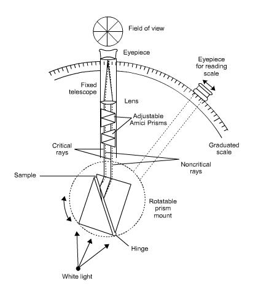
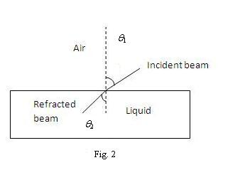
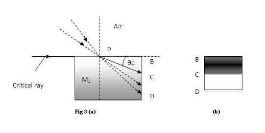
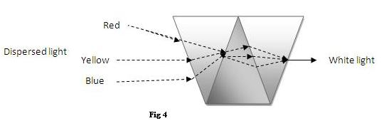

## Introduction 

<iframe width="560" height="315" src="https://www.youtube.com/embed/w-YIzLQwtUk" frameborder="0" allow="autoplay; encrypted-media" allowfullscreen></iframe>

### Abbe's Refractometer

  
Figure 1: Schematic diagram of Abbe instrument optical system
 

 

 The Abbe instrument is the most convenient and widely used refractometer, Fig(1) shows a schematic diagram of its optical system. The sample is contained as a thin layer (~0.1mm) between two prisms. The upper prism is firmly mounted on a bearing that allows its rotation by means of the side arm shown in dotted lines. The lower prism is hinged to the upper to permit separation for cleaning and for introduction of the sample. The lower prism face is rough-ground: when light is reflected into the prism, this surface effectively becomes the source for an infinite number of rays that pass through the sample at all angels. The radiation is refracted at the interface of the sample and the smooth-ground face of the upper prism. After this it passes into the fixed telescope. Two Amici prisms that can be rotated with respect to another serve to collect the divergent critical angle rays of different colors into a single white beam, that corresponds in path to that of the sodium D ray. The eyepiece of the telescope is provided with crosshairs: in making a measurement, the prism angle is changed until the light-dark interface just coincides with the crosshairs. The position of the prism is then established from the fixed scale (which is normally graduates in units of nD). Thermosetting is accomplished by circulation of water through the jackets surrounding the prism.

The Abbe refractometer is very popular and owes its popularity to its convenience, its wide range (nD = 1.3 to 1.7), and to the minimal sample is needed. The accuracy of the instrument is about ~ ±0.0002; its precision is half this figure. The most serious error in the Abbe instrument is caused by the fact that the nearly glazing rays are cut off by the arrangement of to prisms; the boundary is thus less sharp than is desirable.

A precision Abbe refractometer, that diminishes the uncertainties of the ordinary instrument by a factor of about three, is also available; the improvement in accuracy is obtained by replacing the compensator with a monochromatic source and by using larger and more precise prism mounts. The former provides a much sharper critical boundary, and the latter allows a more accurate determination of the prism position.

## Theory
 

### Measurement of refractive index

The refractive index of a substance is ordinarily determined by measuring the change in direction of colliminated radiation as it passes from one medium to another.

$$\frac{n_2}{n_1}=\frac{v_1}{v_2}=\frac{\sin \theta_1}{\sin \theta_2}............(1)$$

Where $v_1$ is the velocity of propagation in the less dense medium M1 and $v_2$ is the velocity in medium $M_2$; $n_1$ and $n_2$ are the corresponding refractive indices and $\theta_1$ and $\theta_2$ are the angles of incidence and refraction, respectively Fig 2.

When $M_1$ is a vacuum, $n_1$ is unity because $v_1$ becomes equal to c in equation (1). Thus,

$$n_2=n_{vac}=\frac{c}{v_2}=\frac{\sin \theta_1}{\sin \theta_2}..............(2)$$

Where $n_{vac}$ is the absolute refractive index of $M_2$. Thus nvac can be obtained by measuring the two angles $\theta_1$ and $\theta_2$.

<h2>Factors Affecting Refractive Index</h2>

Various factors that affect refractive index measurement are:

<ol>
  <li>
    <strong>Temperature</strong> 
    
Temperature influences the refractive index of a medium primarily because of the accompanying change in density. For many liquids, the temperature coefficient lies in the range of -4 to -6 × 10-4 °C-1. Water is an important exception, with a coefficient of about -1 × 10-4 °C-1.

  </li>
  
  <li>
    <strong>Wavelength of light used</strong> 
    
The refractive index of a transparent medium gradually decreases with increasing wavelength; this effect is referred to as <em>normal dispersion</em>. In the vicinity of absorption bands, rapid changes in refractive index occur; here the dispersion is <em>anomalous</em>.

  </li>
  
  <li>
    <strong>Pressure</strong> 
    
The refractive index of a substance increases with pressure because of the accompanying rise in density. The effect is most pronounced in gases, where the change in <em>n</em> amounts to about 3 × 10-4 per atmosphere; the figure is less by a factor of 10 for liquids, and it is yet smaller for solids.

  </li>
</ol>

<h3>Instrument for Measuring Refractive Index</h3>

<strong>Refractometers:</strong> These are based upon measurement of the critical angle or upon the determination of displacement of an image.

<h3>Critical Angle Refractometers</h3>

  The most widely used instruments for the measurements of refractive index are of the critical angle type.
  The <strong>critical angle</strong> is the angle of refraction in a medium when the angle of the incident radiation is 90&deg; (the grazing angle); 
  that is, when &theta;1 in the above equation (1) is 90&deg;, &theta;2 becomes the <em>critical angle</em> &theta;C.

$$\frac{n_2}{n_1}=\frac{\sin 90}{\sin \theta_c}=\frac{1}{\sin \theta_c}..............(3)$$

  The <strong>Fig. 3(a)</strong> illustrates the critical angle that is formed when the critical ray approaches the surface of the medium M2 at 90&deg;</strong> to the normal 
  and is then refracted at some point <em>O</em> on the surface.

  Note that if the medium could be viewed end-on, as in <strong>Fig. 3(b)</strong>, the critical ray would appear as the boundary between a dark and a light field.
  However, the illustration is unrealistic in that the rays are shown as entering the medium at only one point <em>O</em>; 
  in fact, they would be expected to enter at all points along the same angle &theta;C.

  A condensing or focusing lens is needed to produce a single dark-light boundary such as shown in <strong>Fig. 3(b)</strong>.

  <strong>Fig. 3(a)</strong> illustrates the critical angle &theta;C and the critical ray, and <strong>Fig. 3(b)</strong> shows the end-on view, 
  depicting a sharp boundary between the dark and light fields formed at the critical angle.

  The critical angle depends upon wavelength. Thus, if polychromatic radiation is used, no single sharp boundary such as that in <strong>Fig. 3(b)</strong> is observed. 
  Instead, a diffuse chromatic region between the light and dark areas develops, making the precise establishment of the critical angle impossible.

  This difficulty is overcome in refractometers by the use of monochromatic radiation. As a convenient alternative, many critical angle refractometers are equipped with 
  a <strong>compensator</strong> that allows the use of radiation from a tungsten source, while compensating for the resulting dispersion to provide a refractive index 
  in terms of the sodium D line.

  The compensator is made of <strong>Amici prisms</strong>, as shown in <strong>Fig. 4</strong>. The properties of this complex prism are such that the dispersed radiation 
  is converged to give a beam of light that travels in the path of the yellow sodium D line.

Fig: 4. Amici prism for compensation of dispersion by sample. Note that yellow radiation (sodium D line) suffers no net deviation from passage through the prism.

### Polarisability
Using Claussius Mosotti relation, we can calculate polarisabilty of the given liquid. In S.I units

$$\alpha_p = \frac{3 \varepsilon_0 M}{\rho N_A} \cdot \frac{n^2 - 1}{n^2 + 2}.....(4)$$

Where $\varepsilon_0$ is electrical permittivity in free space, $N_A$ is Avogadro's number;
for a given liquid sample, $\alpha_p$ is the polarizability, $n$ is the refractive index, $\rho$ is the density of the given liquid, and $M$ is the molecular weight.

<h2>Temperature Dependence of Refractive Index</h2>

The refractive index of a liquid varies with density, primarily because the density of liquids varies with temperature.
One can approximate the dependence with the equation:

$$n(T) = n(T_0) + \alpha_T (T - T_0)............(5)$$

Where $T_0$ is some standard temperature, $n(T_0)$ is the known index of refraction at $T_0$,
and $\alpha_T$ is the temperature coefficient of the index of refraction of the given liquid.
Values of $\alpha_T$ vary, but they tend to be –0.0003 to –0.0004 for liquids with $n < 1.63$
(all of the liquids in this lab) and approximately –0.0007 for liquids with $n > 1.63$.
For simplicity, we take $\alpha_T$ to be –0.0004.

<h2>Wavelength Dependence of Refractive Index</h2>

The refractive index of a material varies with wavelength, a phenomenon known as chromatic dispersion.
In the visible spectrum, it can be represented to a good approximation by <strong>Cauchy’s Equation</strong>:

$$n(\lambda) = A + \frac{B}{\lambda^2}......(6)$$

Where $A$ and $B$ are constants that depend on the material, and $\lambda$ is the vacuum wavelength.
For example, at 20&nbsp;°C:

<ul>
  <li>For water: $A = 1.324$, $B = 0.00319 \ \mu m^2$</li>
  <li>For ethanol: $A = 1.352$, $B = 0.00318 \ \mu m^2$</li>
</ul>

